# Architecture — DevSecOps Reference Pipeline

## Overview

This repository models a secure, agile software delivery pipeline covering the full application lifecycle: from developer commit to production deployment. Each stage integrates automated security controls without blocking the agile delivery flow.

```mermaid
flowchart TD
    DEV([👨‍💻 Developer]) -->|git commit| HOOK

    subgraph LOCAL["🖥️ Local workstation"]
        HOOK[Pre-commit Hook\nGitleaks - secrets\nLint]
    end

    HOOK -->|git push| PR

    subgraph GITHUB["☁️ GitHub"]
        PR[Pull Request] --> CI

        subgraph CI["🔄 CI Pipeline — GitHub Actions"]
            direction TB
            S1[① Build & Test\nCompile + unit tests]
            S2[② SAST\nSemgrep + CodeQL]
            S3[③ Secrets Scan\nGitleaks]
            S4[④ SCA\nTrivy dependencies]
            S5[⑤ Docker Build\nMulti-stage]
            S6[⑥ Image Scan\nTrivy image]
            S7[⑦ IaC Scan\nCheckov]
            S8[⑧ DAST\nOWASP ZAP baseline]
            S9[⑨ Security Report\nSARIF → GitHub Security Tab]

            S1 --> S2 --> S3 --> S4 --> S5 --> S6 --> S7 --> S8 --> S9
        end

        S9 -->|merge if ✅| MAIN[Main branch]
        MAIN --> REGISTRY[Container Registry\nGHCR]
    end

    REGISTRY -->|GitOps pull| CD

    subgraph CD["🚀 CD — Deployment"]
        ARGOCD[ArgoCD\nGitOps sync]
        ARGOCD --> STAGING[Staging]
        STAGING -->|manual approval| PROD[Production]
    end

    subgraph RUNTIME["🛡️ Runtime — KubeForge"]
        RBAC[RBAC\nleast privilege]
        SEALED[Sealed Secrets\nencrypted at rest]
        TRIVY_OP[Trivy Operator\ncontinuous scanning]
        PROM[Prometheus + Grafana\nobservability]
    end

    PROD --> RUNTIME
```



---

## Stage Breakdown

### ① Local workstation — Pre-commit

| Tool | Role | Trigger |
|---|---|---|
| Gitleaks | Detect secrets in code (API keys, tokens...) | `git commit` |
| Linter (golangci-lint / flake8 / eslint) | Code quality per stack | `git commit` |

**Why locally?** Shift Left — block issues as early as possible. A secret caught before the push does not require credential rotation.

---

### ② CI — Static Application Security Testing (SAST)

| Tool | Stacks | What it detects |
|---|---|---|
| Semgrep | Go, Python, Node.js | Injections, unsafe patterns, dangerous practices |
| CodeQL | Go, JavaScript | Complex vulnerabilities, unsafe data flows |

**Thresholds**: Critical and High block the merge. Medium generates a warning on the PR.

---

### ③ CI — Software Composition Analysis (SCA)

| Tool | What it analyzes | CVE database |
|---|---|---|
| Trivy (dependencies) | go.sum, requirements.txt, package-lock.json | NVD, OSV, GitHub Advisory |
| Dependabot | Automated dependency updates | GitHub Advisory |

**Thresholds**: CVE CVSS ≥ 7.0 (High) blocks the merge.

---

### ④ CI — Docker Build (multi-stage)

Each application follows the multi-stage pattern:

```
Stage 1 — Builder  : full image with build tools
Stage 2 — Runtime  : minimal image (distroless or alpine)
                     → reduced attack surface
                     → no shell, no package manager
```

---

### ⑤ CI — Docker Image Scan

| Tool | What it analyzes |
|---|---|
| Trivy (image) | CVE in the base OS, system packages, and layers |
| Checkov | Dockerfile bad practices (USER root, COPY *, etc.) |

---

### ⑥ CI — Infrastructure as Code Scan

| Tool | What it analyzes |
|---|---|
| Checkov | Kubernetes manifests (overpermissive RBAC, capabilities, hostNetwork...) |
| Checkov | Dockerfiles |

---

### ⑦ CI — Dynamic Application Security Testing (DAST)

| Tool | Mode | Environment |
|---|---|---|
| OWASP ZAP | Baseline scan | Ephemeral staging |

DAST runs against a staging environment spun up temporarily during CI. It tests the running application (HTTP headers, XSS, basic injections).

**Limitation**: the ZAP baseline scan is shallow — it covers the most common vulnerabilities, not a full pentest. It is a safety net, not a guarantee.

---

### ⑧ CD — GitOps with ArgoCD

The `main` branch does not trigger a direct deployment. ArgoCD watches the configuration repository (K8s manifests) and synchronizes the cluster state with the declared state in Git.

```
Code repo (this repo)  →  build image  →  GHCR registry
Config repo            →  ArgoCD sync  →  K8s cluster
```

**Security advantage**: the cluster only pulls from the registry — it never has direct access to the source code.

---

### ⑨ Runtime — KubeForge

The runtime layer relies on [KubeForge](https://github.com/Richonn/KubeForge), which provides:

- **RBAC**: least privilege per namespace and per service account
- **Sealed Secrets**: Kubernetes secrets encrypted at rest in Git
- **Trivy Operator**: continuous scanning of deployed images (detects new CVEs post-deployment)
- **Prometheus + Grafana**: observability and alerting

---

## False Positive Management

An overly noisy pipeline will be ignored or bypassed by teams. The strategy:

| Level | Action |
|---|---|
| Critical | Blocks merge — fix required |
| High | Blocks merge — fix required or documented exception |
| Medium | Warning on PR — does not block |
| Low / Info | Ignored in CI, visible in the dashboard |

Exceptions (confirmed false positives) are documented in `.semgrepignore` / `.trivyignore` with a mandatory justification.

---

## Related Projects

| Project | Coverage |
|---|---|
| **ShieldCI** | Automated generation of secure CI pipelines — this project is the manually documented reference version of what ShieldCI automates |
| **KubeForge** | Secure Kubernetes runtime — plugged in as the CD target of this pipeline |
| **DevSecOps Reference Pipeline** | Full chain from commit to cluster, documented and justified |
