# Architecture — DevSecOps Reference Pipeline

## Vue d'ensemble

Ce dépôt modélise une chaîne de production applicative sécurisée et agile, couvrant l'intégralité du cycle de vie logiciel : du commit du développeur au déploiement en production. Chaque étape intègre des contrôles de sécurité automatisés, sans bloquer le flux de livraison agile.

```mermaid
flowchart TD
    DEV([👨‍💻 Développeur]) -->|git commit| HOOK

    subgraph LOCAL["🖥️ Poste local"]
        HOOK[Pre-commit Hook\nGitleaks - secrets\nLint]
    end

    HOOK -->|git push| PR

    subgraph GITHUB["☁️ GitHub"]
        PR[Pull Request] --> CI

        subgraph CI["🔄 Pipeline CI — GitHub Actions"]
            direction TB
            S1[① Build & Test\nCompilation + tests unitaires]
            S2[② SAST\nSemgrep + CodeQL]
            S3[③ Secrets Scan\nGitleaks]
            S4[④ SCA\nTrivy dépendances]
            S5[⑤ Docker Build\nMulti-stage]
            S6[⑥ Image Scan\nTrivy image]
            S7[⑦ IaC Scan\nCheckov]
            S8[⑧ DAST\nOWASP ZAP baseline]
            S9[⑨ Security Report\nSARIF → GitHub Security Tab]

            S1 --> S2 --> S3 --> S4 --> S5 --> S6 --> S7 --> S8 --> S9
        end

        S9 -->|merge si ✅| MAIN[Branche main]
        MAIN --> REGISTRY[Container Registry\nGHCR]
    end

    REGISTRY -->|GitOps pull| CD

    subgraph CD["🚀 CD — Déploiement"]
        ARGOCD[ArgoCD\nGitOps sync]
        ARGOCD --> STAGING[Staging]
        STAGING -->|validation manuelle| PROD[Production]
    end

    subgraph RUNTIME["🛡️ Runtime — KubeForge"]
        RBAC[RBAC\nmoindre privilège]
        SEALED[Sealed Secrets\nchiffrement des secrets]
        TRIVY_OP[Trivy Operator\nscan continu]
        PROM[Prometheus + Grafana\nobservabilité]
    end

    PROD --> RUNTIME
```



---

## Détail des étapes

### ① Poste local — Pre-commit

| Outil | Rôle | Déclencheur |
|---|---|---|
| Gitleaks | Détection de secrets dans le code (clés API, tokens...) | `git commit` |
| Linter (golangci-lint / flake8 / eslint) | Qualité du code par stack | `git commit` |

**Pourquoi en local ?** Bloquer au plus tôt (Shift Left). Un secret détecté avant le push ne nécessite pas de rotation de credentials.

---

### ② CI — Static Analysis Security Testing (SAST)

| Outil | Stacks couvertes | Ce qu'il détecte |
|---|---|---|
| Semgrep | Go, Python, Node.js | Injections, mauvaises pratiques sécu, patterns dangereux |
| CodeQL | Go, JavaScript | Vulnérabilités complexes, flux de données non sécurisés |

**Seuils** : Critical et High bloquent le merge. Medium génère un warning dans la PR.

---

### ③ CI — Software Composition Analysis (SCA)

| Outil | Ce qu'il analyse | Base de données CVE |
|---|---|---|
| Trivy (dépendances) | go.sum, requirements.txt, package-lock.json | NVD, OSV, GitHub Advisory |
| Dependabot | Mises à jour automatiques des dépendances | GitHub Advisory |

**Seuils** : CVE CVSS ≥ 7.0 (High) bloque le merge.

---

### ④ CI — Build Docker (multi-stage)

Chaque application suit le pattern multi-stage :

```
Stage 1 — Builder  : image complète avec outils de build
Stage 2 — Runtime  : image minimale (distroless ou alpine)
                     → surface d'attaque réduite
                     → pas de shell, pas de package manager
```

---

### ⑤ CI — Scan d'image Docker

| Outil | Ce qu'il analyse |
|---|---|
| Trivy (image) | CVE dans l'OS de base, les packages système, les layers |
| Checkov | Mauvaises pratiques dans le Dockerfile (USER root, COPY *, etc.) |

---

### ⑥ CI — Infrastructure as Code Scan

| Outil | Ce qu'il analyse |
|---|---|
| Checkov | Manifests Kubernetes (RBAC trop permissif, capabilities, hostNetwork...) |
| Checkov | Dockerfiles |

---

### ⑦ CI — Dynamic Analysis Security Testing (DAST)

| Outil | Mode | Environnement |
|---|---|---|
| OWASP ZAP | Baseline scan | Staging éphémère |

Le DAST est lancé sur un environnement de staging déployé temporairement pendant la CI. Il teste l'application en cours d'exécution (headers HTTP, XSS, injections basiques).

**Limite** : le baseline scan ZAP est superficiel — il couvre les vulnérabilités les plus communes, pas un pentest complet. C'est un filet de sécurité, pas une garantie.

---

### ⑧ CD — GitOps avec ArgoCD

La branche `main` ne déclenche pas de déploiement direct. ArgoCD surveille le dépôt de configuration (manifests K8s) et synchronise l'état du cluster avec l'état déclaré dans Git.

```
Code repo (ce dépôt)  →  build image  →  registry GHCR
Config repo           →  ArgoCD sync  →  cluster K8s
```

**Avantage sécu** : le cluster ne pull que depuis le registry — il n'a jamais accès direct au code source.

---

### ⑨ Runtime — KubeForge

Le runtime s'appuie sur [KubeForge](https://github.com/Richonn/KubeForge) qui fournit :

- **RBAC** : moindre privilège par namespace et par service account
- **Sealed Secrets** : chiffrement des secrets Kubernetes au repos
- **Trivy Operator** : scan continu des images déployées (détecte les nouvelles CVE post-déploiement)
- **Prometheus + Grafana** : observabilité et alerting

---

## Gestion des faux positifs

Un pipeline trop bruyant sera ignoré ou contourné par les équipes. La stratégie :

| Niveau | Action |
|---|---|
| Critical | Bloque le merge — correction obligatoire |
| High | Bloque le merge — correction obligatoire ou exception documentée |
| Medium | Warning dans la PR — ne bloque pas |
| Low / Info | Ignoré en CI, visible dans le dashboard |

Les exceptions (faux positifs confirmés) sont documentées dans un fichier `.semgrepignore` / `.trivyignore` avec justification obligatoire.

---

## Lien avec les projets existants

| Projet | Couverture |
|---|---|
| **ShieldCI** | Génération automatique de pipelines CI sécurisés — ce projet est la version référence documentée de ce que ShieldCI automatise |
| **KubeForge** | Runtime Kubernetes sécurisé — branché en CD de ce pipeline |
| **DevSecOps Reference Pipeline** | Chaîne complète du commit au cluster, documentée et justifiée |
