# PipelineForge

> A DevSecOps reference pipeline — from commit to cluster, secured at every stage.


---

## Overview

**PipelineForge** is an open-source reference repository modeling a **secure, agile software delivery pipeline** from end to end. This is not just a CI/CD pipeline — it is a **documented, justified deliverable** designed as a state-of-the-art reference that any team can study, adapt, or deploy.

The project covers three application stacks (**Go, Python, Node.js**) and integrates automated security controls at every stage — from the local commit to production deployment — without sacrificing delivery velocity.

---

## Pipeline

```mermaid
flowchart TD
    DEV([Developer]) -->|git commit| HOOK

    subgraph LOCAL["Local workstation"]
        HOOK[Pre-commit Hook\nGitleaks - secrets\nLint]
    end

    HOOK -->|git push| PR

    subgraph GITHUB["GitHub"]
        PR[Pull Request] --> CI

        subgraph CI["CI Pipeline — GitHub Actions"]
            direction TB
            S1[1. Build and Test\nCompile + unit tests]
            S2[2. SAST\nSemgrep + CodeQL]
            S3[3. Secrets Scan\nGitleaks]
            S4[4. SCA\nTrivy dependencies]
            S5[5. Docker Build\nMulti-stage]
            S6[6. Image Scan\nTrivy image]
            S7[7. IaC Scan\nCheckov]
            S8[8. DAST\nOWASP ZAP baseline]
            S9[9. Security Report\nSARIF to GitHub Security Tab]

            S1 --> S2 --> S3 --> S4 --> S5 --> S6 --> S7 --> S8 --> S9
        end

        S9 -->|merge on pass| MAIN[Main branch]
        MAIN --> REGISTRY[Container Registry\nGHCR]
    end

    REGISTRY -->|GitOps pull| CD

    subgraph CD["CD — Deployment"]
        ARGOCD[ArgoCD\nGitOps sync]
        ARGOCD --> STAGING[Staging]
        STAGING -->|manual approval| PROD[Production]
    end

    subgraph RUNTIME["Runtime — KubeForge"]
        RBAC[RBAC\nleast privilege]
        SEALED[Sealed Secrets\nencrypted at rest]
        TRIVY_OP[Trivy Operator\ncontinuous scanning]
        PROM[Prometheus + Grafana\nobservability]
    end

    PROD --> RUNTIME
```



---

## Integrated Tools

| Stage | Tool | Role |
|---|---|---|
| Pre-commit | Gitleaks | Secret detection before push |
| Pre-commit | golangci-lint / flake8 / eslint | Code quality per stack |
| CI — SAST | Semgrep | Dangerous pattern detection (Go, Python, Node.js) |
| CI — SAST | CodeQL | Data flow analysis (Go, JavaScript) |
| CI — Secrets | Gitleaks | Independent re-scan from local hook |
| CI — SCA | Trivy | CVE in dependencies (go.sum, requirements.txt, package-lock.json) |
| CI — SCA | Dependabot | Automated dependency updates |
| CI — Build | Docker multi-stage | Minimal runtime image (distroless/alpine) — reduced attack surface |
| CI — Image | Trivy | CVE in Docker image (OS, packages, layers) |
| CI — IaC | Checkov | Misconfigurations in Dockerfiles and K8s manifests |
| CI — DAST | OWASP ZAP | Baseline scan on ephemeral staging environment |
| CI — Report | SARIF | Results published to GitHub Security Tab |
| CD | ArgoCD | GitOps sync — cluster state mirrors Git state |
| Runtime | KubeForge | RBAC, Sealed Secrets, Trivy Operator, Prometheus + Grafana |

### Blocking Thresholds

| Level | Action |
|---|---|
| Critical | Blocks merge — fix required |
| High | Blocks merge — fix or documented exception required |
| Medium | Warning on PR — does not block |
| Low / Info | Visible in dashboard, ignored in CI |

---

## Repository Structure

```
PipelineForge/
├── ARCHITECTURE.md          # Pipeline diagram and breakdown of all stages
├── THREAT_MODEL.md          # STRIDE threat analysis of the CI/CD chain itself
├── TOOL_CHOICES.md          # Justification of each tool vs. alternatives
├── DEVSECOPS_REFERENCE.md   # Full guide: Shift Left, SAST/DAST/SCA, false positives
│
├── apps/
│   ├── go-app/              # Go REST API — intentional vulnerabilities for demo
│   ├── python-app/          # Python API (FastAPI)
│   └── node-app/            # Node.js API (Express)
│
└── .github/
    └── workflows/
        ├── ci.yml           # Orchestrator — chains all reusable workflows
        ├── build.yml        # Build and unit tests
        ├── security.yml     # Gitleaks, Semgrep, CodeQL, Trivy SCA
        ├── docker.yml       # Docker build, Trivy image scan, Checkov
        └── report.yml       # Job summary
```

---

## Threat Model

The CI/CD chain itself is a critical attack surface: it has access to secrets, the container registry, and the production cluster. [`THREAT_MODEL.md`](./THREAT_MODEL.md) applies the **STRIDE** methodology across the full perimeter:

- Developer workstation
- GitHub repository and workflows
- GitHub Actions runners
- Container Registry (GHCR)
- ArgoCD (GitOps/CD)
- Kubernetes cluster (runtime)
- Supply chain (third-party dependencies)

> References: Codecov incident 2021, tj-actions incident 2025, CERT-Wavestone report 2025.

---

## Roadmap

- [x] **Phase 1** — Foundations: architecture, threat model, roadmap
- [ ] **Phase 2** — Demo applications (Go, Python, Node.js) with intentional vulnerabilities
- [ ] **Phase 3** — Full CI/CD pipeline with all security scanning tools
- [ ] **Phase 4** — Secrets management, SHA pinning, Dependabot
- [ ] **Phase 5** — State-of-the-art documentation (DEVSECOPS_REFERENCE.md, TOOL_CHOICES.md)
- [ ] **Phase 6** — Polish and public release

---

## Related Projects

| Project | Role |
|---|---|
| [ShieldCI](https://github.com/Richonn/ShieldCI) | Automatically generates secure pipelines — PipelineForge is the manually documented reference version |
| [KubeForge](https://github.com/Richonn/KubeForge) | Secure Kubernetes runtime — plugged in as the CD target of this pipeline |

Together, the three projects provide complete DevSecOps coverage from commit to cluster.

---

## License

[MIT](./LICENSE) — Leandre Cacarie, 2026.
